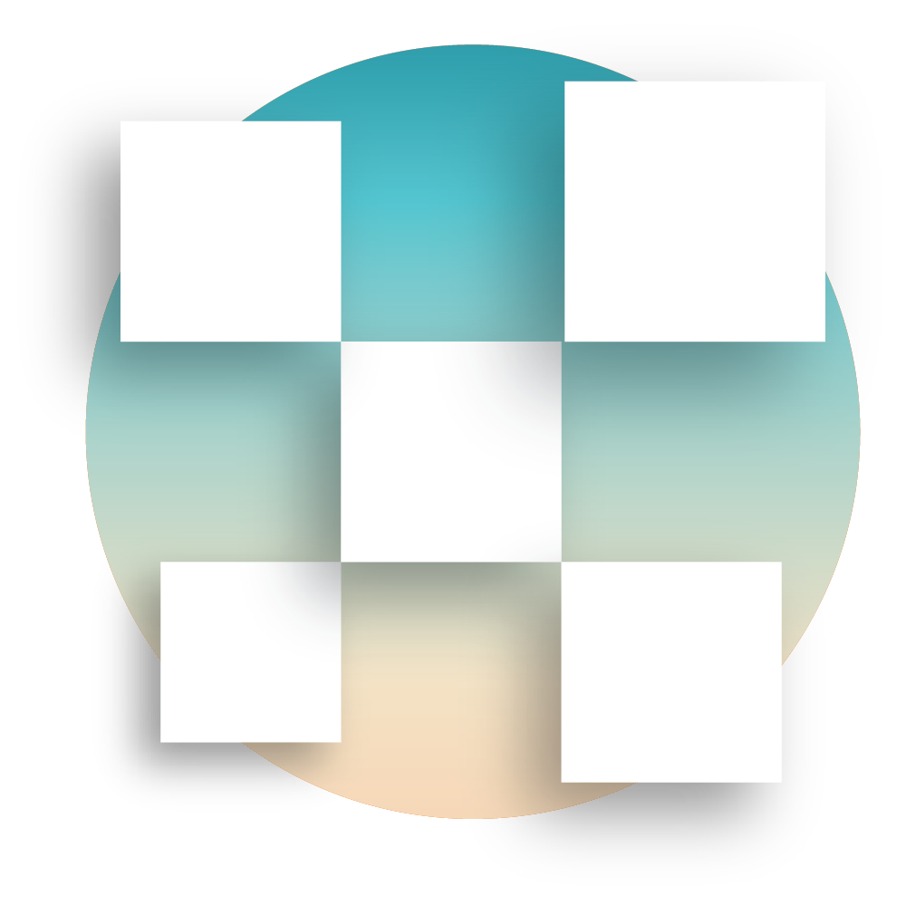

<!--
*** Thanks for checking out this README Template. If you have a suggestion that would
*** make this better, please fork the repo and create a pull request or simply open
*** an issue with the tag "enhancement".
*** Thanks again! Now go create something AMAZING! :D
***
***
***
*** To avoid retyping too much info. Do a search and replace for the following:
*** github_username, repo, twitter_handle, email
-->

<!-- PROJECT SHIELDS -->
<!--
*** I'm using markdown "reference style" links for readability.
*** Reference links are enclosed in brackets [ ] instead of parentheses ( ).
*** See the bottom of this document for the declaration of the reference variables
*** for contributors-url, forks-url, etc. This is an optional, concise syntax you may use.
*** https://www.markdownguide.org/basic-syntax/#reference-style-links
-->

[![Contributors][contributors-shield]][contributors-url]
[![Forks][forks-shield]][forks-url]
[![Stargazers][stars-shield]][stars-url]
[![Issues][issues-shield]][issues-url]
[![MIT License][license-shield]][license-url]
[![LinkedIn][linkedin-shield]][linkedin-url]

<!-- PROJECT LOGO -->
<br />
<p align="center">
  <a href="https://github.com/mengistristen/openchess">
    
  </a>

  <h2 align="center">openchess</h3>

  <p align="center">
    A simple API for playing games that use an 8x8 checker board.
    <br />
    <!-- PUT S3 DOCS HERE <a href="https://github.com/mengistristen/openchess"><strong>Explore the docs »</strong></a>
    <br />-->
    <br />
    <!-- PUT S3 DEMO HERE <a href="https://github.com/github_username/repo">View Demo</a>-->
    <!--·-->
    <a href="https://github.com/mengistristen/openchess/issues">Report Bug</a>
    ·
    <a href="https://github.com/mengistristen/openchess/issues">Request Feature</a>
  </p>
</p>

<!-- TABLE OF CONTENTS -->

## Table of Contents

-   [About the Project](#about-the-project)
    -   [Built With](#built-with)
-   [Getting Started](#getting-started)
-   [How To Play](#how-to-play)
    -   [Moving Pieces](#moving-pieces)
    -   [Manually Ending A Game](#manually-ending-a-game)
-   [Customization and Options](#customization-and-options)
    -   [Game Type](#game-type)
    -   [Board Size](#board-size)
    -   [Board Color](#board-color)
    -   [Board Frame](#board-frame)
    -   [Piece Style](#piece-style)
-   [Roadmap](#roadmap)
-   [Contributing](#contributing)
-   [License](#license)
-   [Contact](#contact)
-   [Acknowledgements](#acknowledgements)

<!-- ABOUT THE PROJECT -->

## About The Project

openchess is a simple api that takes http requests and returns svg images representing the current state of the game being played.

<!--[![Product Name Screen Shot][product-screenshot]](https://example.com)

Here's a blank template to get started:
**To avoid retyping too much info. Do a search and replace with your text editor for the following:**
`github_username`, `repo`, `twitter_handle`, `email`-->

### Built With

-   [JavaScript](https://www.javascript.com/)
-   [Express.js](https://expressjs.com/)
-   [Redis](https://redislabs.com/)

<!-- GETTING STARTED -->

## Getting Started

openchess is a public REST API. That means **no authorization** is needed.

There are endless ways to use openchess, we encourage you experiment, just remember to report any [issues](https://github.com/mengistristen/openchess/issues) you come across!

Before you can send commands and recieve svgs you must start a game, do so with the following `GET` method
```sh
GET  openchess.com/new
```
If successful, you will get a json object with your new game key. This key will be used in all request that involve this game, so make sure to save it.
You can start as many games as you like, just keep in mind that latency may be introduced if we recieve too much traffic.

The above request is the most straightforward way to begin a game of **chess**. But what if you don't want to play chess? Here's how you [change the game type](#game-type).

## How To Play

Now that you've [started a game](#getting-started) you probably want to know [how to play](#how-to-play).

### Moving Pieces

### Manually Ending A Game
    
openchess games automatically expire after **1 hour of inactivity**. However, if you feel so inclined to remove a game earlier you may do so with the following `GET` method:
```sh
GET  openchess.com/game/<game_key>/end
```

## Customization and Options

There are numerous ways to customize your openchess game, including:
1. [Game Type](#game-type)
2. [Board Size](#board-size)
3. [Board Color](#board-color)
4. [Board Frame](#board-frame)
5. and [Piece Style](#piece-style)

### 1. Game Type

Despite the name, openchess actually supports playing any game that uses an 8x8 checkerboard (that we've implemented). Here's how you do it:
```sh
GET  openchess.com/new%game=<option_name>
```

Here is the list of all supported games:

| Game | option_name |
| --- | --- |
| [Chess](https://en.m.wikipedia.org/wiki/Chess) | chess |
| [Checkers/Draughts](https://en.m.wikipedia.org/wiki/Draughts) | checkers |
| [Amazons](https://en.m.wikipedia.org/wiki/Game_of_the_Amazons) | amazons |

Example:
```sh
GET  openchess.com/new%game=amazons
```

<!---   #### Checkers
```sh
openchess.com/new%game=checkers
```

-   #### Chess
```sh
openchess.com/new%game=chess
```

-   #### Checkers
```sh
openchess.com/new%game=checkers
```
-   #### [Absorption](https://boardgamegeek.com/boardgame/63114/absorption)
```sh
openchess.com/new%game=absorption
```
-   #### [0·1 (Zero Point One)](https://boardgamegeek.com/boardgame/114307/01-zero-point-one)
```sh
openchess.com/new%game=zpo
```-->
We are always looking to add new games to this projects, if you have a suggestion for one please leave it [here](https://github.com/mengistristen/openchess/issues) or better yet, do it yourself by [contributing](#contributing).

2. ### Board Size

### 3. Board Color

### 4. Board Frame

### 5.Piece Style

## Roadmap

See the [open issues](https://github.com/mengistristen/openchess/issues) for a list of proposed features (and known issues).

<!-- CONTRIBUTING -->

## Contributing

Contributions are what make the open source community such an amazing place to learn, inspire, and create. Any contributions you make are **greatly appreciated**.

1. Fork the Project
2. Create your Feature Branch (`git checkout -b feature/AmazingFeature`)
3. Commit your Changes (`git commit -m 'Add some AmazingFeature'`)
4. Push to the Branch (`git push origin feature/AmazingFeature`)
5. Open a Pull Request

<!-- LICENSE -->

## License

Distributed under the MIT License. See `LICENSE` for more information.

<!-- CONTACT -->

## Contact

Tristen Mengis - [@thetmeng](https://twitter.com/thetmeng) <!--- [website]()-->

Justin Boehnen - [@boehnenj](https://twitter.com/boehnenj) - [website](https://www.justinboehnen.com)

<!-- ACKNOWLEDGEMENTS -->

## Acknowledgements

<!-- 
-   []()
-   []()
-   []()
-->

<!-- MARKDOWN LINKS & IMAGES -->
<!-- https://www.markdownguide.org/basic-syntax/#reference-style-links -->

[contributors-shield]: https://img.shields.io/github/contributors/mengistristen/openchess.svg?style=flat-square
[contributors-url]: https://github.com/mengistristen/openchess/graphs/contributors
[forks-shield]: https://img.shields.io/github/forks/mengistristen/openchess.svg?style=flat-square
[forks-url]: https://github.com/mengistristen/openchess/network/members
[stars-shield]: https://img.shields.io/github/stars/mengistristen/openchess.svg?style=flat-square
[stars-url]: https://github.com/mengistristen/openchess/stargazers
[issues-shield]: https://img.shields.io/github/issues/mengistristen/openchess.svg?style=flat-square
[issues-url]: https://github.com/mengistristen/openchess/issues
[license-shield]: https://img.shields.io/github/license/mengistristen/openchess.svg?style=flat-square
[license-url]: https://github.com/mengistristen/openchess/blob/master/LICENSE.txt
[linkedin-shield]: https://img.shields.io/badge/-LinkedIn-black.svg?style=flat-square&logo=linkedin&colorB=555

<!--[linkedin-url]: https://linkedin.com/in/othneildrew-->

[product-screenshot]: images/screenshot.png
